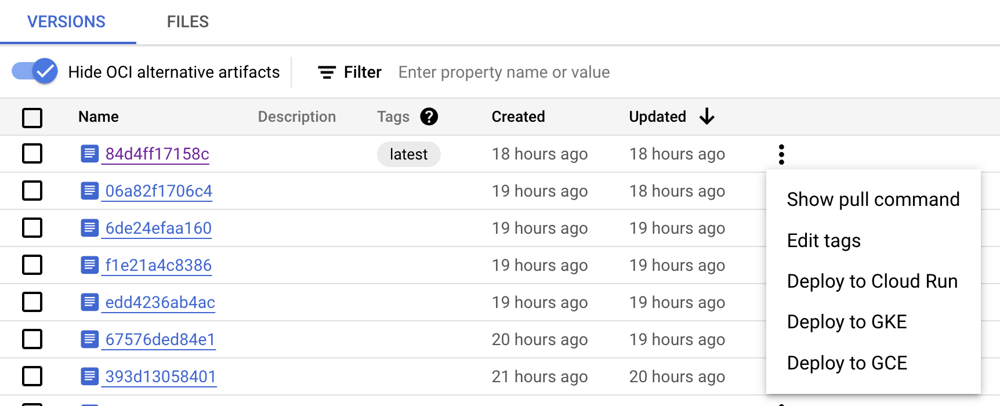
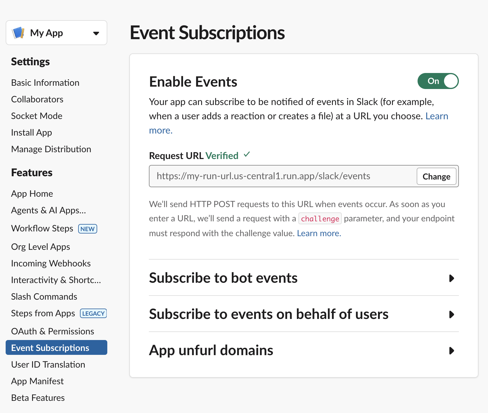
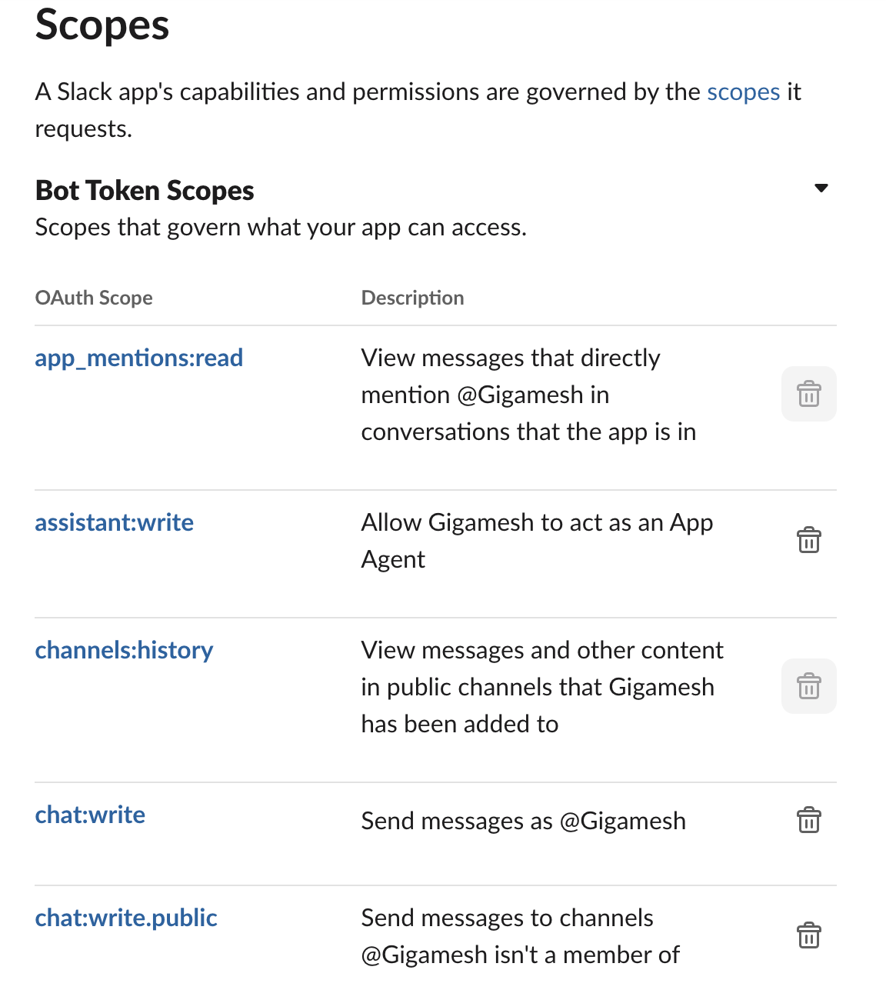

# slack-openai-bot

To deploy this bot on Google Cloud, first create an artifact registry to push it to. Then build the Docker image with a complete `.env` file.

```bash
docker build -t us-central1-docker.pkg.dev/$GOOGLE_CLOUD_PROJECT/$FOLDER/slack-bot .
```

You can test the image locally or push it to Artifact Registry.

```bash
docker push us-central1-docker.pkg.dev/$GOOGLE_CLOUD_PROJECT/$FOLDER/slack-bot
```

From there, you can click-button deploy it to Google Cloud Run.



And if deployed properly, take the public URL given to you by Cloud Run and give it to the Event Configuration app configuration in Slack.



In order to interact with the bot via mentions, make sure it has the proper scopes - mainly the app_mentions:read, chat:write and chat:write.public (I think).


